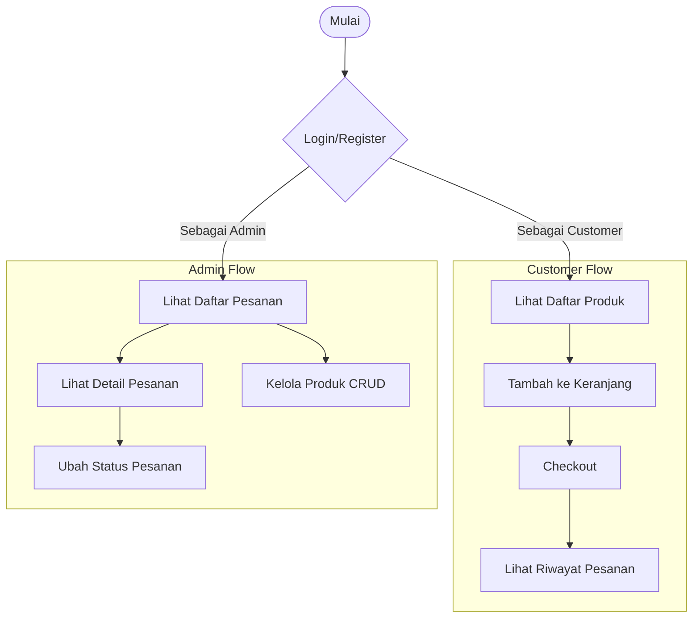
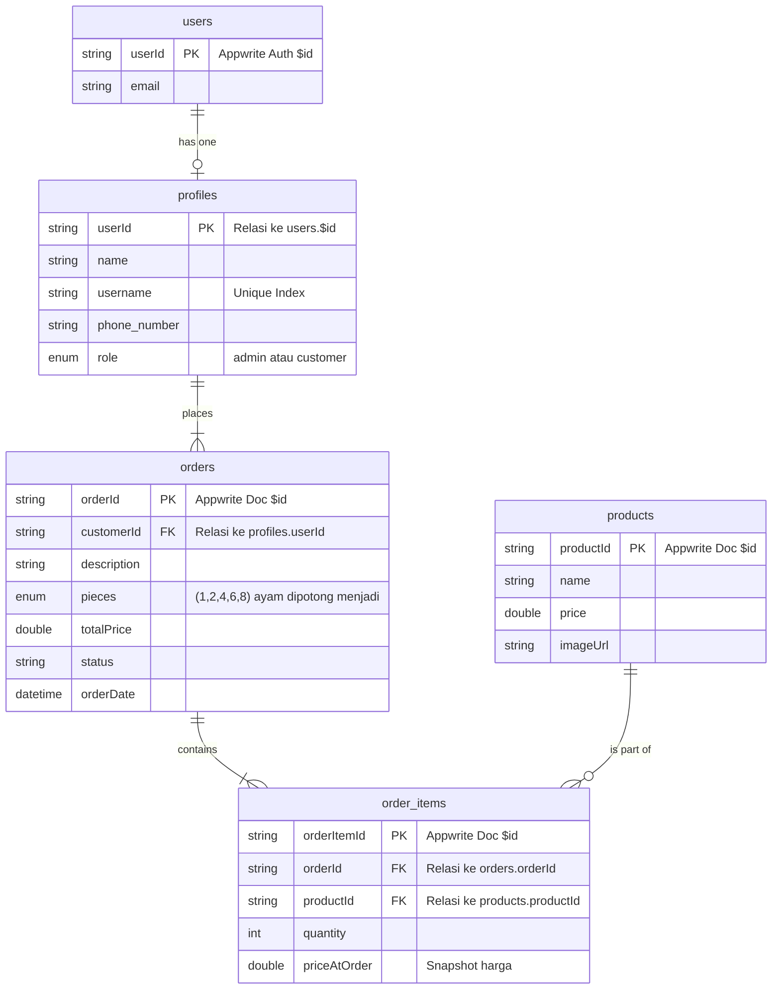

Aplikasi pemesanan Ayam Potong dibuat dengan flutter

---
#  Diagram 
 ##  Diagram Alur Aplikasi

```mermaid
flowchart TD
    Start([Mulai])
    Login{Login/Register}

    subgraph CustomerFlow[Customer Flow]
        C1[Lihat Daftar Produk]
        C2[Tambah ke Keranjang]
        C3[Checkout]
        C4[Lihat Riwayat Pesanan]
    end

    subgraph AdminFlow[Admin Flow]
        A1[Lihat Daftar Pesanan]
        A2[Lihat Detail Pesanan]
        A3[Ubah Status Pesanan]
        A4[Kelola Produk CRUD]
    end

    Start --> Login
    Login -->|Sebagai Customer| C1
    C1 --> C2 --> C3 --> C4

    Login -->|Sebagai Admin| A1
    A1 --> A2 --> A3
    A1 --> A4
```
---
 ##  Diagram Relasi Database

```mermaid
erDiagram
    users {
        string userId PK "Appwrite Auth $id"
        string email
    }

    profiles {
        string userId PK "Relasi ke users.$id"
        string name
        string username "Unique Index"
        string phone_number
        enum role "admin  atau customer"
    }

    products {
        string productId PK "Appwrite Doc $id"
        string name
        double price
        string imageUrl
    }

    orders {
        string orderId PK "Appwrite Doc $id"
        string customerId FK "Relasi ke profiles.userId"
        string description 
        enum pieces  "(1,2,4,6,8) ayam dipotong menjadi"
        double totalPrice
        string status
        datetime orderDate
    }

    order_items {
        string orderItemId PK "Appwrite Doc $id"
        string orderId FK "Relasi ke orders.orderId"
        string productId FK "Relasi ke products.productId"
        int quantity
        double priceAtOrder "Snapshot harga"
    }

    users ||--o| profiles : "has one"
    profiles ||--|{ orders : "places"
    orders ||--|{ order_items : "contains"
    products ||--o{ order_items : "is part of"
```
---
