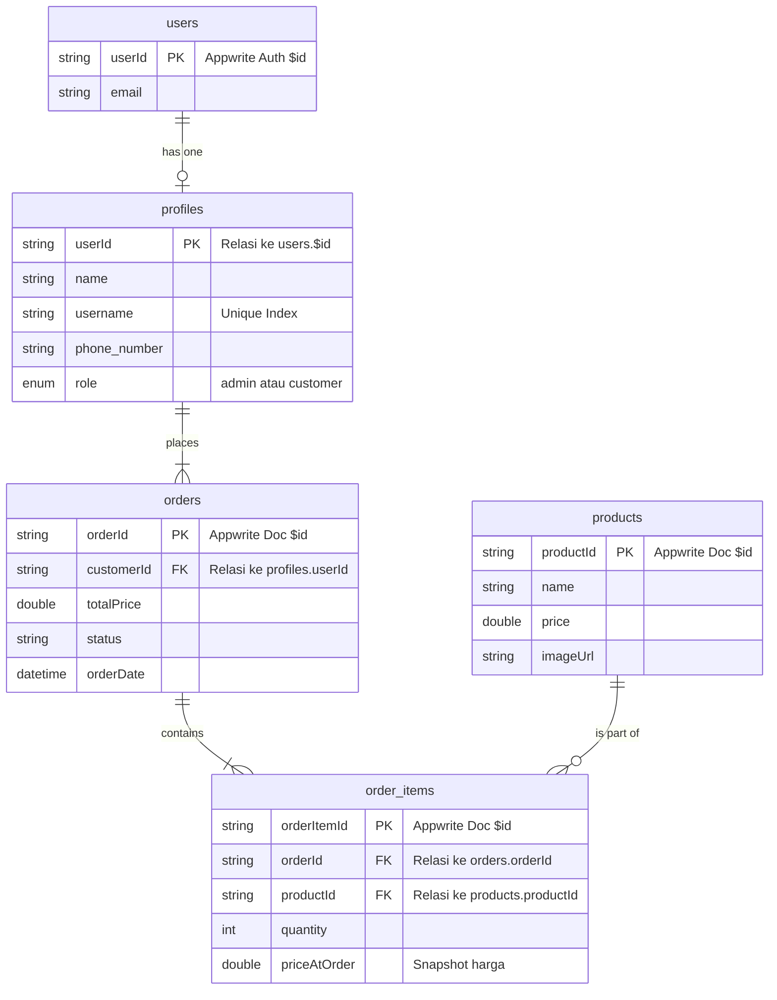

## 📦 Dokumen Software Requirement Specification (SRS)

### Aplikasi Pemesanan Ayam Potong 

**Versi:** 0.2
**Tanggal:** 23 Mei 2024
**Penyusun:** Tim Pengembang

---

## 1. Pendahuluan

### 1.1 Tujuan Dokumen

Dokumen ini mendefinisikan kebutuhan perangkat lunak untuk MVP aplikasi **Pesan Ayam Potong**, yang memungkinkan customer memesan Ayam Potong dan admin mengelola produk serta pesanan.

### 1.2 Ruang Lingkup Produk

Aplikasi mobile (Flutter) yang memungkinkan:

* Customer: Registrasi, login, lihat produk, tambah ke keranjang, dan Pesan Ayam Potong.
* Admin: CRUD produk, lihat dan ubah status pesanan.

**Catatan:** Tidak mencakup pembayaran online atau pengiriman.

### 1.3 Istilah

* **MVP:** Minimum Viable Product
* **BaaS:** Backend-as-a-Service
* **CRUD:** Create, Read, Update, Delete

---

## 2. Deskripsi Umum

### 2.1 Perspektif Produk

Aplikasi mobile dengan backend Appwrite untuk autentikasi, database, dan penyimpanan gambar produk.

### 2.2 Fungsi Utama

* Login/Registrasi Customer & Admin
* CRUD Produk oleh Admin
* Pemesanan Produk oleh Customer
* Manajemen status pesanan oleh Admin

### 2.3 Karakteristik Pengguna

* **Customer:** Warung, kafe, EO yang butuh pasokan es
* **Admin:** Pengelola toko Ayam Potong

### 2.4 Batasan

* Tanpa sistem pembayaran dan pengiriman
* Role admin ditentukan manual via Appwrite Console
* Tidak ada fitur pencarian, filter, rating

### 2.5 Asumsi

* Koneksi internet aktif
* Appwrite berjalan stabil
* Username bersifat unik

---

## 3. Kebutuhan Spesifik

### 3.1 Alur Pengguna

1. Registrasi atau login
2. Akses sesuai peran:

   * Customer: lihat produk → tambah keranjang → checkout → lihat riwayat
   * Admin: lihat pesanan & detail → ubah status → kelola produk

### 3.2 Kebutuhan Fungsional

* **F01:** Registrasi dengan email, password, username unik, dan no\_hp
* **F02:** Login sesuai peran (redirect ke dashboard)
* **F03:** Customer melihat daftar produk
* **F04:** Customer memesan dan sistem simpan item + harga saat itu
* **F05:** Admin melakukan CRUD produk
* **F06:** Admin melihat pesanan + detail item
* **F07:** Admin mengubah status pesanan

### 3.3 Kebutuhan Non-Fungsional

* **NF01:** Support Android & iOS
* **NF02:** Waktu respon < 3 detik
* **NF03:** UI minimalis & mudah dipahami
* **NF04:** Feedback visual untuk loading/error

### 3.4 Antarmuka Eksternal

* Flutter Appwrite SDK: auth, database, storage

---

## 4. Rancangan Skema Database (Appwrite)

### 📁 Koleksi: `users` (Auth bawaan Appwrite)

| Field | Type   | Keterangan                 |
| ----- | ------ | -------------------------- |
| \$id  | string | ID unik dari Appwrite Auth |
| email | string | Email pengguna             |
| name  | string | Diisi dengan username      |

### 📁 Koleksi: `profiles`

| Field         | Type   | Keterangan                           |
| ------------- | ------ | ------------------------------------ |
| \$id          | string | Sama dengan users.\$id               |
| name | string | Nama                            |
| username      | string | Unik untuk tampilan display          |
| phone\_number | string | Nomor HP                             |
| role          | enum | customer / admin (default: customer) |

### 📁 Koleksi: `products`

| Field       | Type    | Keterangan        |
| ----------- | ------- | ----------------- |
| \$id        | string  | ID produk         |
| name        | string  | Nama produk       |
| description | string  | Deskripsi produk  |
| price       | double  | Harga per unit    |
| imageUrl    | string  | URL gambar produk |
| stock       | integer | Stok tersedia     |

### 📁 Koleksi: `orders`

| Field      | Type     | Keterangan          |
| ---------- | -------- | ------------------- |
| \$id       | string   | ID pesanan          |
| customerId | string   | FK ke profiles.\$id |
| description       | string | deskripsi pesanan    |
| pieces       | enum | (1,2,4,6,8) ayam dipotong menjadi berapa bagian    |
| totalPrice | double   | Total harga pesanan |
| status     | string   | pending / processed |
| orderDate  | datetime | Timestamp ISO8601   |

### 📁 Koleksi: `order_items`

| Field        | Type    | Keterangan          |
| ------------ | ------- | ------------------- |
| \$id         | string  | ID item pesanan     |
| orderId      | string  | FK ke orders.\$id   |
| productId    | string  | FK ke products.\$id |
| quantity     | integer | Jumlah produk       |
| priceAtOrder | double  | Harga saat dipesan  |

---

## 5. Arsitektur Sistem

* **Frontend:** Flutter Mobile App (Android/iOS)
* **Backend:** Appwrite BaaS
* **Storage:** Gambar produk (via Appwrite Storage)
* **Auth:** Appwrite Auth
* **Database:** Appwrite Database (collections di atas)

---

## 6. Timeline Pengembangan (6 Minggu)

* Minggu 1: Setup project, auth, dan struktur koleksi
* Minggu 2: CRUD produk
* Minggu 3: Keranjang & order\_items
* Minggu 4: Checkout & pesanan
* Minggu 5: Admin dashboard & status pesanan
* Minggu 6: Testing, UI polishing

---

## 7. Diagram ER (Relasi Database)

---

## 8. Penutup

Dokumen ini menjadi acuan utama pengembangan aplikasi 'Pesan Ayam Potong' versi MVP. Dapat diperbarui jika ada perubahan kebutuhan dan pengembangan lanjutan.
