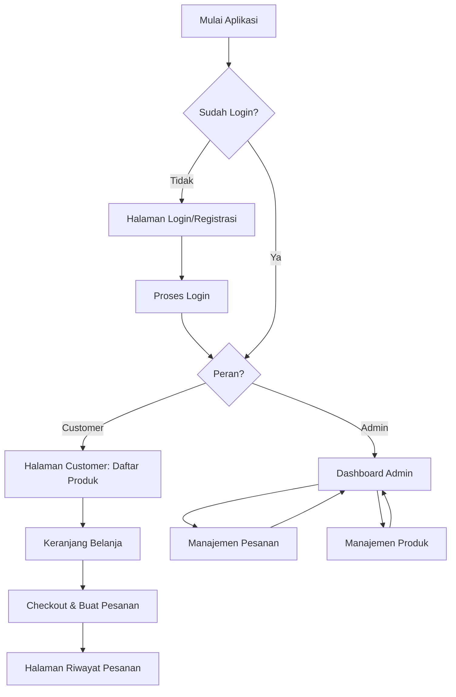
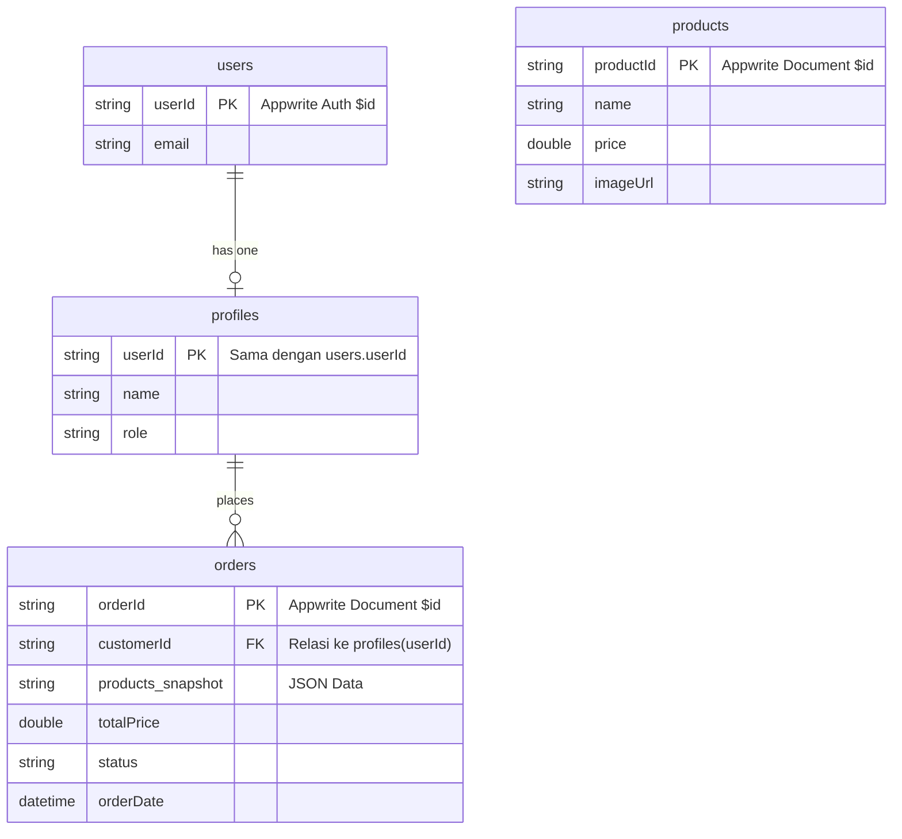

### Dokumen Software Requirement Specification (SRS)

## Aplikasi Pemesanan es batu

**Versi:** 0.1
**Tanggal:** 27 Mei 2025
**Penyusun:** Azhar Maulana F (221240001263)

---

### 1. Pendahuluan

#### 1.1 Tujuan Dokumen

Dokumen ini disusun untuk mendefinisikan kebutuhan perangkat lunak dari Minimum Viable Product (MVP) aplikasi Pesan Es. Tujuannya adalah untuk menjadi acuan utama bagi tim pengembang dalam membangun aplikasi yang memungkinkan customer memesan es batu dan admin mengelola pesanan serta produk.

#### 1.2 Ruang Lingkup Produk (MVP)

Aplikasi Pesan Es adalah aplikasi mobile berbasis Flutter yang memungkinkan pengguna untuk:

* Mendaftar dan login sebagai Customer atau Admin (berdasarkan peran).
* Customer dapat melihat daftar produk, menambahkan ke keranjang, dan membuat pesanan.
* Admin dapat mengelola (membuat, membaca, mengubah, menghapus) produk.
* Admin dapat melihat dan mengubah status pesanan yang masuk.

Pembayaran online dan sistem pengiriman tidak termasuk dalam lingkup MVP ini.

#### 1.3 Definisi, Akronim, dan Singkatan

* MVP: Minimum Viable Product
* UI: User Interface
* UX: User Experience
* BaaS: Backend-as-a-Service
* SRS: Software Requirement Specification
* CRUD: Create, Read, Update, Delete

### 2. Deskripsi Umum

#### 2.1 Perspektif Produk

Aplikasi ini merupakan sistem mobile mandiri yang memanfaatkan Appwrite sebagai backend untuk autentikasi, database, dan penyimpanan file (gambar produk). Aplikasi memiliki dua antarmuka utama yang ditentukan oleh peran pengguna setelah login.

#### 2.2 Fungsi Utama Produk

* Autentikasi dan manajemen peran pengguna (Admin & Customer).
* Manajemen produk (CRUD) oleh Admin.
* Katalog produk untuk Customer.
* Sistem keranjang belanja dan pembuatan pesanan.
* Manajemen pesanan (melihat dan update status) oleh Admin.

#### 2.3 Karakteristik Pengguna

* Customer: Pengguna umum, pemilik usaha kecil (warung, kafe), atau penyelenggara acara yang membutuhkan pasokan es batu.
* Admin: Pemilik atau staf toko es batu yang bertanggung jawab mengelola produk dan pesanan.

#### 2.4 Batasan Umum

* Aplikasi tidak menangani proses pembayaran; transaksi diasumsikan terjadi secara offline.
* Tidak ada fitur pelacakan pengiriman (delivery tracking).
* Penentuan peran admin dilakukan secara manual melalui Appwrite Console.
* Tidak ada fitur pencarian, filter, atau rating produk pada versi MVP.

#### 2.5 Asumsi dan Ketergantungan

* Pengguna memiliki koneksi internet yang aktif untuk menggunakan aplikasi.
* Layanan Appwrite (cloud atau self-hosted) berjalan stabil.
* Gambar produk disediakan oleh Admin.

### 3. Kebutuhan Spesifik

#### 3.1 Alur Pengguna

1. Pengguna membuka aplikasi.
2. Melakukan registrasi (default sebagai Customer) atau login.
3. Jika Customer: Diarahkan ke Halaman Produk, memilih produk, menambah ke keranjang, checkout, dan melihat riwayat pesanan.
4. Jika Admin: Diarahkan ke Dashboard Admin, dapat melihat pesanan masuk atau mengelola produk (tambah/edit/hapus).
5. Admin mengubah status pesanan yang masuk (misal: dari "Pending" ke "Diproses").

#### 3.2 Kebutuhan Fungsional

* **F01**: Pengguna dapat mendaftar dengan email & password.
* **F02**: Pengguna dapat login dan diarahkan sesuai perannya (Admin/Customer).
* **F03**: Customer dapat melihat daftar semua produk.
* **F04**: Customer dapat membuat pesanan dari produk yang ada di keranjang.
* **F05**: Admin dapat melakukan CRUD pada data produk (termasuk upload gambar).
* **F06**: Admin dapat melihat semua pesanan yang masuk.
* **F07**: Admin dapat mengubah status pesanan.

#### 3.3 Kebutuhan Non-Fungsional

* **NF01**: Aplikasi harus dapat berjalan di platform Android dan iOS.
* **NF02**: Waktu respon untuk menampilkan data dari server maksimal 3 detik.
* **NF03**: UI harus bersih, minimalis, dan mudah dipahami.
* **NF04**: Aplikasi harus memberikan feedback visual (loading indicator, notifikasi error) untuk setiap aksi yang membutuhkan waktu.

#### 3.4 Kebutuhan Antarmuka Eksternal

* Appwrite SDK (Flutter): Untuk komunikasi dengan backend (Auth, Database, Storage).

### 4. Rancangan Skema Database (Appwrite)

**Collection: users (Bawaan Appwrite)**

| Field | Type   | Description                |
| ----- | ------ | -------------------------- |
| \$id  | string | ID unik dari Appwrite Auth |
| email | string | Email pengguna             |
| name  | string | Nama pengguna              |

**Collection: profiles**

| Field | Type   | Description                     | Notes                  |
| ----- | ------ | ------------------------------- | ---------------------- |
| \$id  | string | Appwrite Document ID (PK)       | Sama dengan users.\$id |
| name  | string | Nama lengkap pengguna           |                        |
| role  | string | Peran pengguna (customer/admin) | Default: customer      |

**Collection: products**

| Field       | Type    | Description               | Notes                 |
| ----------- | ------- | ------------------------- | --------------------- |
| \$id        | string  | Appwrite Document ID (PK) |                       |
| name        | string  | Nama produk               |                       |
| description | string  | Deskripsi produk          |                       |
| price       | double  | Harga produk per unit     |                       |
| imageUrl    | string  | URL gambar produk         | Dari Appwrite Storage |
| stock       | integer | Jumlah stok yang tersedia |                       |

**Collection: orders**

| Field              | Type     | Description                            | Notes                   |
| ------------------ | -------- | -------------------------------------- | ----------------------- |
| \$id               | string   | Appwrite Document ID (PK)              |                         |
| customerId         | string   | ID pengguna yang memesan               | Relasi ke profiles.\$id |
| customerName       | string   | Nama pengguna yang memesan             |                         |
| products\_snapshot | string   | Data produk saat dipesan (format JSON) | Mencegah inkonsistensi  |
| totalPrice         | double   | Total harga pesanan                    |                         |
| status             | string   | Status pesanan (pending, processed)    |                         |
| orderDate          | datetime | Tanggal dan waktu pesanan dibuat       | Disimpan sbg ISO 8601   |

### 5. Arsitektur Sistem

* **Frontend**: Aplikasi mobile cross-platform dibangun dengan Flutter.
* **Backend**: Appwrite sebagai BaaS.
* **Appwrite Auth**: Mengelola autentikasi pengguna.
* **Appwrite Database**: Menyimpan data profiles, products, dan orders.
* **Appwrite Storage**: Menyimpan file gambar untuk produk.

### 6. Estimasi Timeline Pengembangan (6 Minggu)

| Minggu | Aktivitas                                                        |
| ------ | ---------------------------------------------------------------- |
| 1      | Setup project Flutter & Appwrite, desain UI/UX dasar.            |
| 2      | Implementasi alur Login & Registrasi, penentuan peran.           |
| 3      | Halaman Customer: Menampilkan produk, keranjang, dan checkout.   |
| 4      | Halaman Admin: CRUD (Create, Read, Update, Delete) untuk produk. |
| 5      | Halaman Admin: Menampilkan daftar pesanan dan update status.     |
| 6      | Pengujian end-to-end, perbaikan bug, dan finalisasi UI/UX.       |

### 7. Diagram Alur

### 8. Relasi Database (ER Diagram)

### 9. Penutup

Dokumen ini menjadi landasan dan acuan utama untuk pengembangan MVP aplikasi 'Pesan Es'. Dokumen dapat diperbarui seiring dengan perkembangan proyek.
